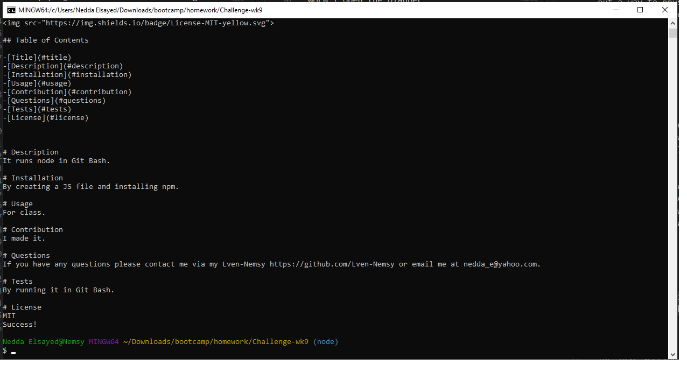

# Challenge-Wk9
Node.js

## Description
This is a command-line application that dynamically generates a professional README.md file from a user's input using the Inquirer package.

## Usage
To use the Professional README Generator, first install via Git Bash:
- npm install

Then, run the following command:
- node index.js 

This will prompt you for information about your project: the title, description, installation instructions, usage information, contributions, contact info, tests, and license. Once you have answered all of the prompts, the generator will create a README.md file in the current directory.

## Features
The Professional README Generator includes the following features:

- Generates a professional README.md file in Markdown syntax.
- Prompts for information about the  project, such as the title, description, installation instructions, and usage information.
- Supports a variety of options, such as the license, contributing guidelines, and test instructions
- Can be easily customized to meet specific needs

## Contributing
Cloning the repo is welcome. Do not push new code into the repo without creating a pull requests

## Credits

Troubleshooted with Kyle Jocoy, Chelsea Wagner & Donnie Rawlings. Used Phind.com for debugging.

## License
N/A

---

https://github.com/Lven-Nemsy/Challenge-Wk9

https://drive.google.com/file/d/1jpGcK3qJ-Q8XxfsACUlhHVqF8uXAuEub/view

